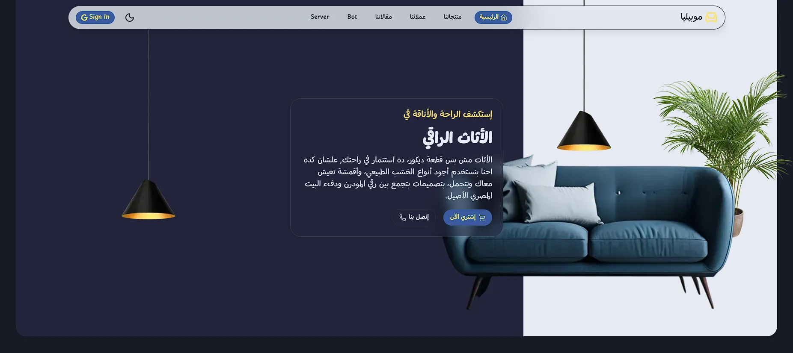
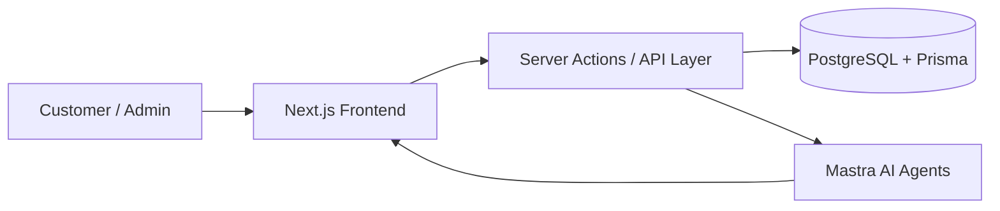

# Furniture | Home Decor E-Commerce Platform

## Overview

This project is a modern, full-stack e-commerce platform dedicated to selling furniture and home decor products. It is designed not only as a shopping experience, but also as a high-value digital product that combines product management, authentication, media handling, and AI-powered assistance in a single cohesive ecosystem.

The application reflects a modern software engineering approach, where performance, scalability, maintainability, and user experience are treated as first-class priorities.

## Why This Project Matters

This platform goes beyond a traditional online store. It demonstrates how a modern web application can combine:

- a polished customer-facing storefront
- a robust admin-ready data model
- secure authentication and authorization
- intelligent user interaction through AI agents
- a scalable architecture suitable for future growth

From a technical perspective, the project is built to showcase contemporary web development practices, strong type safety, real-time interaction patterns, and a modern AI-integrated experience.

## Core Features

- Elegant product catalog for furniture and decor items
- Product browsing by category, style, color, and factory
- Product detail pages with rich media and descriptions
- Favorites and shopping cart flows
- User authentication and role-based access
- Admin-oriented data structure for managing products and related entities
- Image upload and media management support
- AI-powered assistant for interior design guidance and conversational experience

## Technology Stack

### Frontend

- Next.js 16 with React 19
  - Chosen for its modern App Router model, server-side rendering capabilities, excellent performance, and strong support for production-grade web applications.
  - Technologically, it provides a future-ready foundation for scalable, SEO-friendly, and highly interactive experiences.

- TypeScript
  - Selected to ensure strict type safety, better developer productivity, and fewer runtime errors.
  - It significantly increases code quality and maintainability, especially for medium-to-large applications.

- Tailwind CSS, shadcn/ui, Radix UI, and Motion
  - These tools were chosen to accelerate UI development while maintaining accessibility, consistency, and visual quality.
  - They represent a modern design system approach that reduces custom implementation overhead and improves product polish.

### Backend & Data Layer

- Prisma ORM
  - Chosen for its elegant schema-driven development model and type-safe database access.
  - It bridges the gap between application code and database design with high reliability and developer efficiency.

- PostgreSQL
  - Selected as a robust relational database for structured e-commerce data such as users, products, classes, styles, colors, factories, and favorites.
  - It provides strong consistency, scalability, and long-term data integrity.

### Authentication & Security

- Better Auth
  - Chosen for a modern authentication experience that supports secure session handling and role-based access.
  - It improves security architecture while reducing boilerplate compared to traditional manual auth setups.

### AI & Intelligent Experience

- Mastra
  - Selected to orchestrate intelligent agents and workflows in a structured, extensible way.
  - It is a highly relevant technology for building AI-driven products with clear separation between business logic and agent behavior.

- AI SDK and Ollama integration
  - These were incorporated to enable conversational AI and intelligent user assistance.
  - This adds a strong technological edge by transforming the storefront into an interactive, assistant-driven experience rather than a passive catalog.

- Streamdown and related UI components
  - Chosen to provide rich streaming experiences for AI responses.
  - These technologies improve user engagement and make the AI layer feel native and modern.

### State Management & Media

- Zustand
  - Used for lightweight and efficient global state management.
  - It offers a simple and scalable alternative to heavier state libraries for focused client-side state needs.

- UploadThing
  - Selected for modern file and media upload workflows.
  - It simplifies image handling and helps create a smoother product media management experience.

### Quality & Development Standards

- Vitest
  - Added to support automated testing and regression safety.
  - It strengthens confidence in future changes and helps maintain software quality.

- ESLint and TypeScript strictness
  - These ensure consistent coding standards, better maintainability, and fewer avoidable issues during development.

## Why These Technologies Were Chosen

The technical choices in this project were made with a clear strategy:

1. Performance-first architecture
   - Next.js and React provide excellent rendering performance and strong production capabilities.

2. Strong developer experience
   - TypeScript, Prisma, and modern tooling reduce friction and increase reliability.

3. Modern product experience
   - AI integration, streaming UI, and polished component systems make the platform feel contemporary and innovative.

4. Scalability and maintainability
   - The project uses modular architecture and typed data models, which make future expansion easier.

5. High technological value
   - The combination of e-commerce, AI agents, modern auth, and schema-driven backend architecture reflects a highly relevant and future-oriented stack.

## Architecture Overview

The project follows a modular and modern application structure:

- Frontend pages and UI live under the app layer
- Business logic and server actions are organized in dedicated directories
- Database models are defined through Prisma schema
- AI-related functionality is contained in the bot layer
- Shared types and helpers improve reusability and consistency

This structure supports long-term maintainability while keeping the codebase organized and extensible.

## Project Structure Highlights

- app/: main application routes and pages
- components/: reusable UI and page-level components
- actions/: server actions and business logic
- bot/: AI agents, workflows, and assistant-related logic
- prisma/: database schema and Prisma configuration
- schemas/: validation and input schemas
- lib/: shared utilities and core integrations

## Project Vision

This project aims to redefine the concept of an online furniture store by combining traditional e-commerce functionality with modern AI experiences, strong architecture, and a premium digital product feel. The vision is to create a platform that is not only visually attractive and commercially useful, but also technically advanced and scalable for future expansion.

## Architecture Diagram

## Tech Highlights

- Modern full-stack architecture using Next.js, React, and TypeScript
- Strong type safety and schema-driven backend development with Prisma
- Secure authentication and role-based access with Better Auth
- AI-enhanced experience powered by Mastra and conversational interfaces
- Clean UI system built with Tailwind CSS, shadcn/ui, Radix UI, and Motion
- Scalable data layer and media workflow with PostgreSQL and UploadThing
- Testing and quality assurance support through Vitest and ESLint

## Summary

This project is a strong example of a modern e-commerce solution that combines commercial functionality with advanced software engineering practices. It is built around a high-value technology stack that balances user experience, scalability, security, and intelligent interaction.

It is especially valuable because it demonstrates how traditional e-commerce can evolve into a smarter, more interactive, and technologically advanced digital experience.
